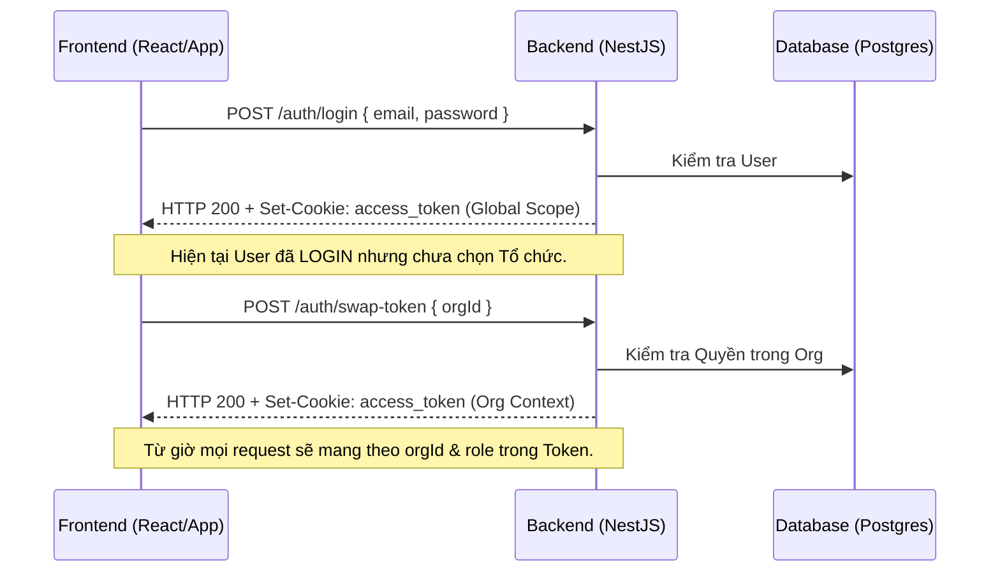

# 📚 Home-Server API & Documentation for Frontend

Tài liệu này cung cấp chi tiết về các Endpoint, luồng xác thực và cách tích hợp cho đội ngũ Frontend.

---

## 1. Cơ chế Xác thực (Authentication)

Hệ thống sử dụng **JWT kết hợp HttpOnly Cookie**. 
- **Lợi ích**: Bảo mật tuyệt đối trước tấn công XSS (JS không thể đọc Token).
- **Yêu cầu quan trọng**: Frontend (Axios/Fetch) phải bật cấu hình `withCredentials: true` để trình duyệt tự động gửi/nhận Cookie.

### 🔄 Luồng Đăng nhập & Đổi tổ chức (Tenant Swapping)



---

## 2. Danh sách Endpoint Chi tiết

### 🔐 Module: Authentication (`/auth`)

| Endpoint | Method | Body | Mô tả |
| :--- | :--- | :--- | :--- |
| `/auth/register` | POST | `{ email, password, name }` | Đăng ký tài khoản mới. Trả về thông tin User. |
| `/auth/login` | POST | `{ email, password }` | Đăng nhập Global. Trả về Cookie `access_token`. |
| `/auth/swap-token` | POST | `{ orgId }` | Đổi sang ngữ cảnh Tổ chức cụ thể. Trả về Token chứa `orgId` và `role`. |
| `/auth/refresh` | POST | `{}` | Gia hạn Token khi hết hạn. |
| `/auth/logout` | POST | `{}` | Xóa trắng Cookie. |

### 👤 Module: Users (`/users`)

| Endpoint | Method | Body | Mô tả |
| :--- | :--- | :--- | :--- |
| `/users/me` | GET | `{}` | Lấy thông tin cá nhân của User hiện tại (kèm ẩn trường nhạy cảm). |
| `/users/me` | PATCH | `{ name?, avatar?, phoneNumber?, bio? }` | Cập nhật thông tin hồ sơ của User. |
| `/users/:id` | GET | `{}` | Xem hồ sơ công khai của User khác (chỉ trả về `id`, `name`, `avatar`, `bio`, `createdAt`). |

### 🏢 Module: Organizations (`/organizations`)

| Endpoint | Method | Body | Quyền | Mô tả |
| :--- | :--- | :--- | :--- | :--- |
| `/:orgId/invites` | POST | `{ role, expiresInDays }` | Admin/Owner | Tạo mã mời (8 ký tự). |
| `/join/:code` | POST | `{}` | Mọi User | Gia nhập tổ chức qua mã mời. |

---

## 3. Quản lý Quyền (Roles & Policies)

Backend sử dụng **CASL**. Dữ liệu `role` nằm trong `access_token`. FE có thể dùng trường này để hiển thị giao diện phù hợp:

- **ORG_ADMIN**: Có toàn quyền quản lý (`Action.Manage`).
- **ORG_MEMBER**: Chỉ có quyền xem (`Action.Read`).

---

## 4. Xử lý Lỗi (Error Handling)

Hệ thống trả về mã lỗi HTTP chuẩn:
- `401 Unauthorized`: Token hết hạn hoặc sai thông tin đăng nhập. (FE nên redirect về trang Login).
- `403 Forbidden`: User không có quyền thực hiện hành động này.
- `400 Bad Request`: Validation lỗi (Thiếu trường, sai định dạng).
- `404 Not Found`: Tài nguyên không tồn tại.

---

## 🚀 Hướng dẫn Test API (cURL)

**Đăng nhập mẫu:**
```bash
curl -X POST http://localhost:3000/auth/login \
     -H "Content-Type: application/json" \
     -d '{"email": "user@example.com", "password": "password123"}'
```
