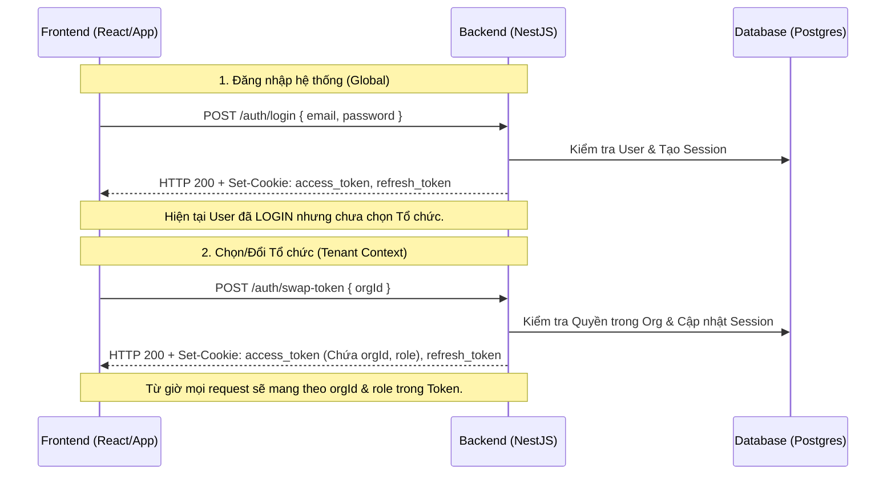
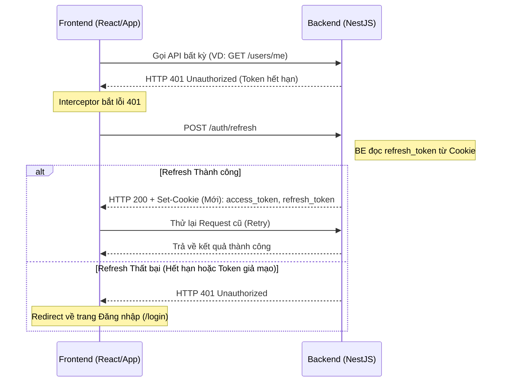

Tài liệu này cung cấp chi tiết về các Endpoint, luồng xác thực và cách tích hợp cho đội ngũ Frontend.

---

## 🟢 1. Cấu trúc Phản hồi Chuẩn (Standardized Response)

Toàn bộ API (trừ các trường hợp lỗi hệ thống nghiêm trọng) đều trả về một cấu trúc JSON đồng nhất. Frontend nên dựa vào cấu trúc này để xử lý dữ liệu và hiển thị thông báo.

### 📦 Cấu trúc Success (2xx)
```typescript
interface ApiResponse<T> {
  success: boolean;  // Luôn luôn là true cho các request thành công
  message: string;   // Thông báo nghiệp vụ từ máy chủ (Dùng để hiển thị Toast/Notification)
  data: T;           // Dữ liệu thực tế trả về (Object, Array, hoặc null)
}
```

**Ví dụ:**
```json
{
  "success": true,
  "message": "Đăng nhập thành công",
  "data": {
    "access_token": "...",
    "user": { "id": "1", "email": "..." }
  }
}
```

### 🚩 Cách sử dụng `message` cho FE
- **Không tự viết text thông báo**: Backend đã định nghĩa các thông báo nghiệp vụ chuẩn (VD: "Cập nhật hồ sơ thành công", "Mã mời đã hết hạn",...). 
- **Hiển thị linh hoạt**: FE chỉ cần gọi hàm hiển thị thông báo (Toast/Snackbar) với nội dung là trường `message` nhận được từ API.

---

## 2. Cơ chế Xác thực (Authentication)

Hệ thống sử dụng **JWT kết hợp HttpOnly Cookie** để đảm bảo an ninh tối đa.

- **Tokens**: Có 2 loại Token:
  - `access_token`: Dùng để xác thực các request. Thời hạn ngắn (15 phút).
  - `refresh_token`: Dùng để lấy `access_token` mới khi hết hạn. Thời hạn dài (7 ngày).
- **Lưu trữ**: Cả 2 đều được Backend trả về dưới dạng `Set-Cookie` với cờ `HttpOnly`.
  - **Lợi ích**: Bảo mật tuyệt đối trước tấn công XSS (JS không thể đọc Token).
- **Yêu cầu quan trọng đối với Frontend**: 
  - Phải bật cấu hình `withCredentials: true` trong Axios/Fetch để trình duyệt tự động gửi/nhận Cookie.

### 🔄 Luồng Đăng nhập & Đổi tổ chức (Tenant Swapping)



---

## 2. Luồng Làm mới Token (Refresh Token Flow)

Khi `access_token` hết hạn (Server trả về `401 Unauthorized`), Frontend cần thực hiện luồng Refresh để lấy Token mới mà không bắt User đăng nhập lại.

### 🔄 Sơ đồ Refresh Token



**Lưu ý quan trọng cho FE:**
- Endpoint `/auth/refresh` không yêu cầu Header Authorization (vì Token cũ đã hết hạn). BE sẽ tự đọc từ Cookie.
- Hệ thống có cơ chế **Rotation**: Mỗi lần gọi Refresh thành công, BE sẽ cấp lại cả `access_token` và `refresh_token` mới.
- **Duy trì Ngữ cảnh**: BE sẽ tự động giữ lại `orgId` và `role` của bạn nếu bạn đang ở trong một Tổ chức.

---

## 3. Danh sách Endpoint Chi tiết

### 🔐 Module: Authentication (`/auth`)

| Endpoint | Method | Body | Mô tả |
| :--- | :--- | :--- | :--- |
| `/auth/register` | POST | `{ email, password, name }` | Đăng ký tài khoản mới. |
| `/auth/login` | POST | `{ email, password }` | Đăng nhập Global. Cấp Cookie tokens. |
| `/auth/swap-token` | POST | `{ orgId }` | Đổi sang ngữ cảnh Tổ chức cụ thể. |
| `/auth/refresh` | POST | `{}` | Gia hạn Token (BE ưu tiên đọc từ Cookie). |
| `/auth/logout` | POST | `{}` | Xóa Session & Xóa Cookies. |

### 👤 Module: Users (`/users`)

| Endpoint | Method | Body | Mô tả |
| :--- | :--- | :--- | :--- |
| `/users/me` | GET | `{}` | Lấy thông tin cá nhân của User hiện tại. |
| `/users/me` | PATCH | `{ name?, avatar?, phoneNumber?, bio? }` | Cập nhật hồ sơ. |
| `/users/:id` | GET | `{}` | Xem hồ sơ công khai của User khác. |

### 🏢 Module: Organizations (`/organizations`)

| Endpoint | Method | Body | Quyền | Mô tả |
| :--- | :--- | :--- | :--- | :--- |
| `/:orgId/invites` | POST | `{ role, expiresInDays }` | Admin/Owner | Tạo mã mời (8 ký tự). |
| `/join/:code` | POST | `{}` | Mọi User | Gia nhập tổ chức qua mã mời. |

---

## 4. Quản lý Quyền (Roles & Policies)

Backend sử dụng **CASL**. Dữ liệu `role` nằm trong `access_token`. FE có thể dùng trường này để hiển thị giao diện phù hợp:

- **ORG_ADMIN**: Có toàn quyền quản lý (`Action.Manage`).
- **ORG_MEMBER**: Chỉ có quyền xem (`Action.Read`).

---

## 5. Xử lý Lỗi (Error Handling)

Hệ thống trả về mã lỗi HTTP chuẩn:
- `401 Unauthorized`: Token hết hạn hoặc sai thông tin. 
  - **Action**: Thực hiện Refresh Token, nếu vẫn 401 thì mới về Login.
- `403 Forbidden`: User không có quyền thực hiện hành động này.
- `400 Bad Request`: Lỗi dữ liệu đầu vào.
- `404 Not Found`: Không tìm thấy tài nguyên.

---

---

## 6. Hướng dẫn Tích hợp (Best Practices)

1. **Axios Interceptor (Response)**: Nên viết một interceptor để tự động "mở gói" data.
   ```javascript
   axios.interceptors.response.use(
     (response) => {
       // Nếu là format chuẩn của hệ thống
       if (response.data && response.data.success) {
         // Bạn có thể hiển thị toast ở đây nếu cần
         // toast.success(response.data.message); 
         return response.data; // Trả về { message, data } thay vì cả response object
       }
       return response;
     },
     (error) => {
       // Xử lý lỗi 401, 403, 500...
       return Promise.reject(error);
     }
   );
   ```
2. **Global State**: Khi Refresh thành công, cập nhật thông tin `orgId` và `role` từ response của `/auth/refresh`.

---

## 🚀 Hướng dẫn Test API (cURL)

**Đăng nhập và nhận Cookie (Lưu session):**
```bash
curl -c cookies.txt -X POST http://localhost:3000/auth/login \
     -H "Content-Type: application/json" \
     -d '{"email": "user@example.com", "password": "password123"}'
```

**Lấy danh sách tổ chức (Yêu cầu Cookie):**
```bash
curl -b cookies.txt http://localhost:3000/organizations/me
```

**Refresh Token (Sử dụng Cookie):**
```bash
curl -b cookies.txt -c cookies.txt -X POST http://localhost:3000/auth/refresh
```
